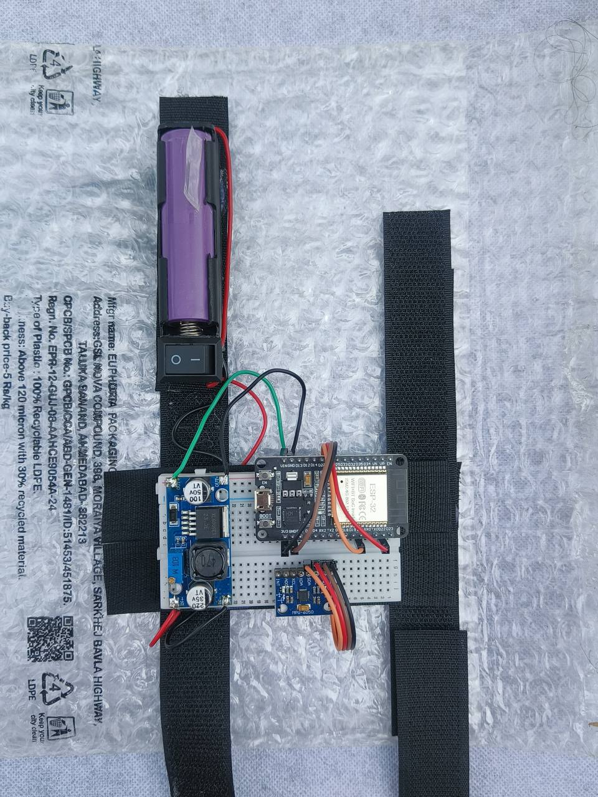
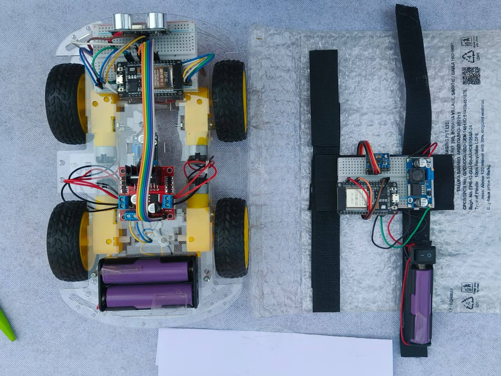
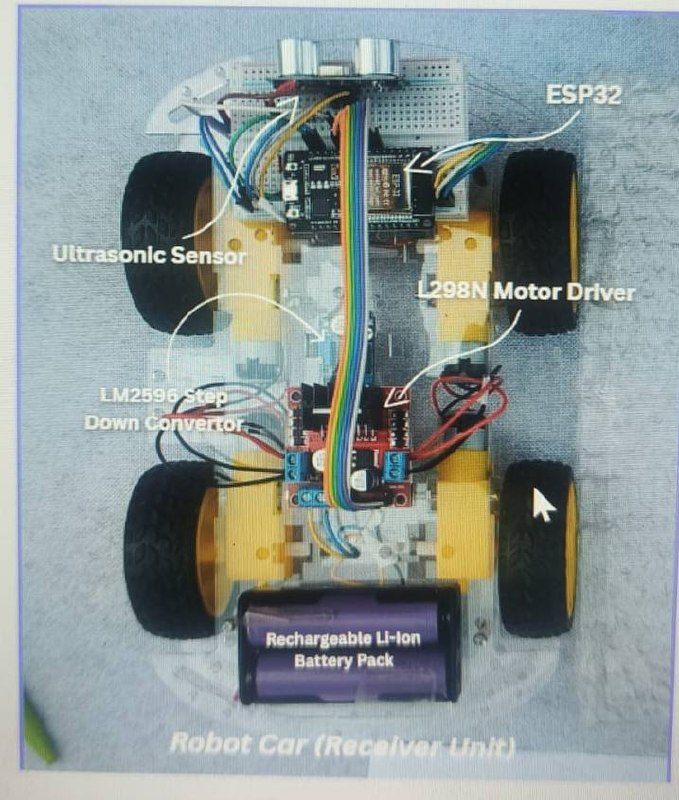

# 🚗 ESP32-Based Hand Gesture & Voice Controlled RC Car

## 📌 Overview

This project demonstrates a smart RC car controlled using **hand gestures** and **voice commands**.
It uses **ESP32 microcontrollers** for real-time wireless communication between a wearable transmitter (glove) and a receiver (car).

---

## 🎯 Features

* 🖐️ Hand gesture control using **MPU6050 (accelerometer + gyroscope)**
* 📡 Wireless communication via **ESP32 (Wi-Fi/Bluetooth)**
* 🚗 Motor control using **L298N motor driver**
* 🚧 Obstacle detection using **ultrasonic sensor (HC-SR04)**
* ⚡ Portable system powered by **Li-ion batteries**

---

## 🧠 System Architecture

### 🖐️ Transmitter (Glove Unit)

* MPU6050 captures hand motion
* ESP32 processes gesture data
* Sends control signals wirelessly

### 🚗 Receiver (Car Unit)

* ESP32 receives signals
* L298N controls motors
* Ultrasonic sensor avoids obstacles

---

## 📸 Project Images

<p align="center">
  
  
  
</p>

---

## 🎥 Demo
<video width="500" controls>
  <source src="RC_Video/demo_video.mp4" type="video/mp4">
  Your browser does not support the video tag.
</video>

---

## 🛠️ Components Used

### 🔹 Transmitter

* ESP32
* MPU6050 Sensor
* LM2596 Step-down Converter
* Li-ion Battery

### 🔹 Receiver

* ESP32
* L298N Motor Driver
* Ultrasonic Sensor (HC-SR04)
* 4WD Chassis with DC Motors
* Li-ion Battery Pack

---

## ⚙️ Working Principle

* Hand tilt is detected using MPU6050
* Data is processed and mapped to movement directions
* Commands are transmitted via ESP32
* Car receives signals and moves accordingly
* Ultrasonic sensor prevents collisions

---

## 🚀 How to Run

1. Upload transmitter code to ESP32 (glove)
2. Upload receiver code to ESP32 (car)
3. Power both units
4. Connect ESP32 modules (Wi-Fi/Bluetooth)
5. Control car using hand gestures

---

## 📂 Project Structure

```
RC_imgs/        → Project images
code/           → ESP32 source code
README.md       → Documentation
```

---

## 💡 Future Improvements

* Mobile app integration 📱
* Advanced voice recognition (AI/ML) 🤖
* Camera-based live streaming 📷
* Autonomous navigation 🚀

---

## 👨‍💻 Author

Shiv Goyal
🔗 GitHub: https://github.com/shivigoyal4321
